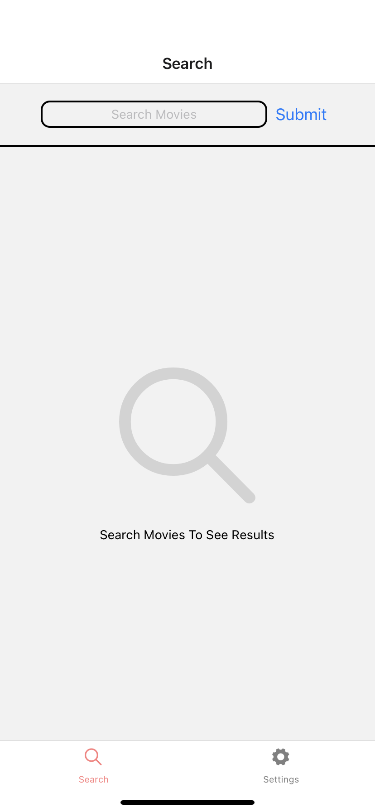
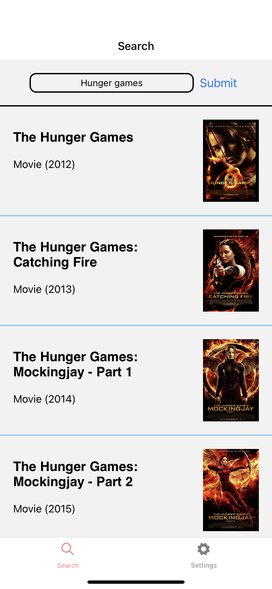
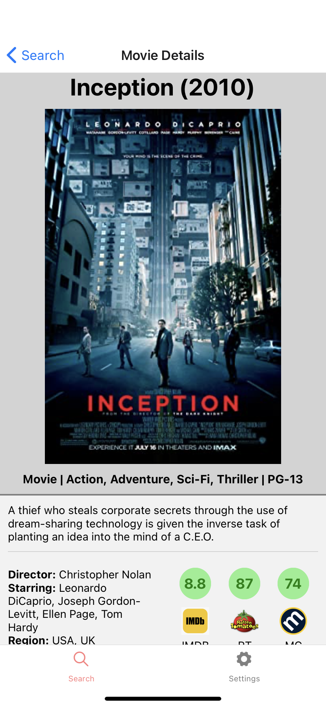

# Movie Browser
Developed a mobile application with movie browser functionality. The app allow users to
search for movies included in the [Open Movie Database](http://www.omdbapi.com/)
and view additional information about any movies they select. Built with React Native on
Expo in October 2020.

## Screenshots

  
  
  

